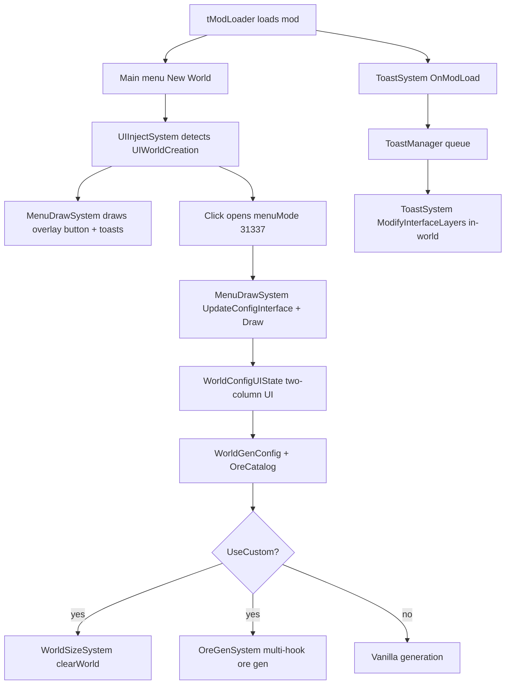
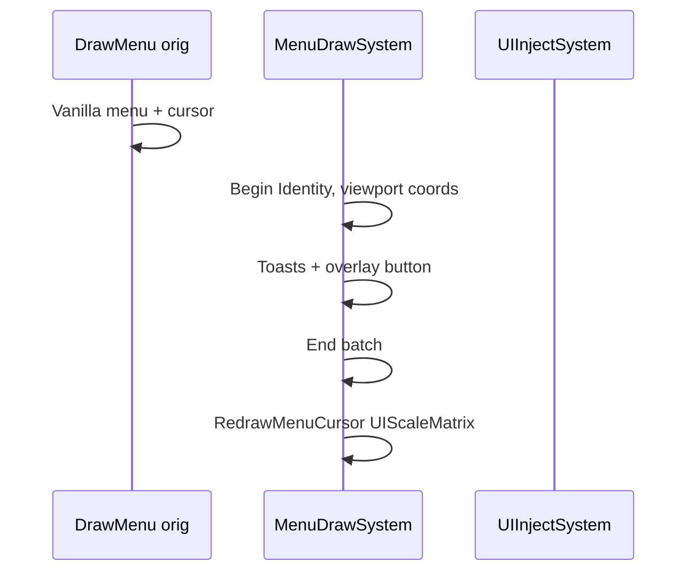
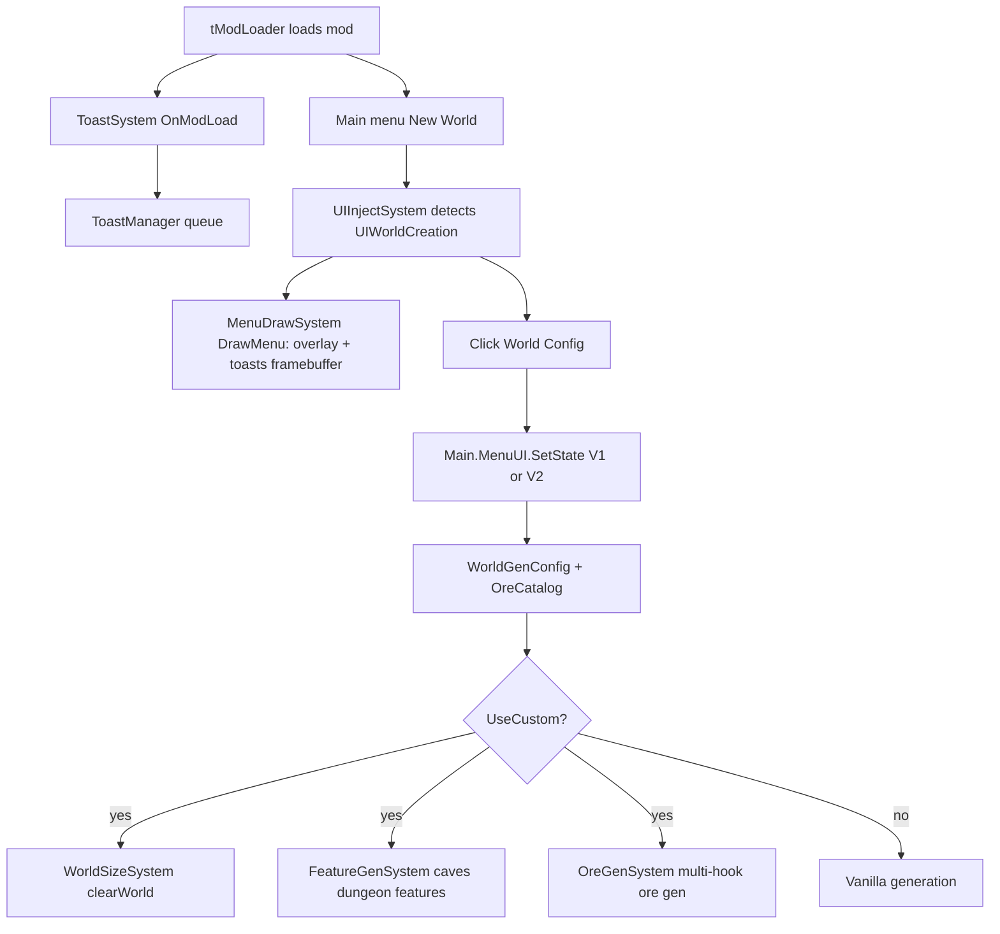

<!-- PRESERVATION RULE: Never delete or replace content. Append or annotate only. -->

# ARCHITECTURE

## Overview



## Systems

| System | Hook | Role |
|--------|------|------|
| `UIInjectSystem` | `UpdateUI` (overlay only), `HandleOverlayInput`, `UpdateConfigInterface` | Detect New World screen; overlay clicks; **config panel input tick** |
| `MenuDrawSystem` | `On_Main.DrawMenu` | Draw overlay + config UI; call `UpdateConfigInterface` before draw in mode 31337 |
| `ToastSystem` | `OnModLoad`, `ModifyInterfaceLayers` | Load toast; in-world toast layer |
| `ToastManager` | static | Toast queue + draw |
| `WorldSizeSystem` | `On_WorldGen.clearWorld` | Set `maxTilesX/Y` before alloc |
| `OreGenSystem` | `ModifyWorldGenTasks`, `ModifyHardmodeTasks`, `On_WorldGen.SmashAltar`, `On_WorldGen.dropMeteor` | Ore scatter + supplements |

## Core (testable, no Terraria)

| Module | Role |
|--------|------|
| `OreCatalog` | 21 wiki ores, phases, UI keys |
| `OreGenMath` | Vein count/size calculations |
| `OreConfigHelper` | Default `OreMul` dict, reset, validation |

## Ore generation (when `UseCustom`)

| Phase | Mechanism |
|-------|-----------|
| Pre-HM metals + evil + rare meteorite | Replace **Shinies** pass (`OreScatterRunner`) |
| Hellstone | Insert pass after **Underworld** |
| Chlorophyte | Append pass in `ModifyHardmodeTasks` |
| HM altar ores | Supplement after `SmashAltar` |
| Meteor biomes | Supplement on `dropMeteor` |

Tile specs: `Common/Ore/OreScatterSpecs.cs`. Obsidian + Luminite catalogued but not world-gen controlled.

## UI architecture

- **Overlay button:** drawn via `SpriteBatch` on vanilla `UIWorldCreation` (no vanilla tree mutation).
- **Config panel:** custom `UIState` via standalone `UserInterface`; `Main.menuMode = 31337`.
- **Layout:** near-fullscreen two columns — left: world size; right: scrollable ore sliders.
- **Input path:** `MenuDrawSystem` → `UpdateConfigInterface` → `UserInterface.Update` (not `UpdateUI` alone).
- **Scroll:** `UIScrollColumn` + `ApplyScrollWheel` + `PlayerInput.LockVanillaMouseScroll`.

Opening config saves `Main.MenuUI.CurrentState` and restores on close.

## Settings model

`WorldGenConfig` — session-scoped statics: dimensions, `UseCustom`, vein/frequency multipliers, `OreMul` from `OreConfigHelper.CreateDefaultOreMul()` (21 keys). **`ApplyDebugWorldGenPreset()`** — 4200×1200 (min safe), ×20 vein/frequency.

## Tests & build

```
Core/ + WorldGenConfig.cs  ──linked──►  WorldConfigMod.Tests/  (59 tests)
repo/  ──robocopy──►  ModSources/WorldConfigMod/  (excludes DOCS, Tests, test.bat, Test.gui.bat)
                              │
                              ▼
                         WorldConfigMod.tmod
```

Runners: `test.bat` (minimal), `Test.gui.bat` (discovery + detailed console + pause). Detection: Steam registry → `tModLoader.dll`. `build.bat` repo-only; excludes `DOCS/`, `WorldConfigMod.Tests/`, dev batch scripts.

## [AMENDED 2026-05-19]:

Documented toast layer and overlay-button refactor. Build path updated for modern tML (no standalone `.exe`).

## [AMENDED 2026-05-19]: Ore catalog + multi-hook gen

Full ore pipeline, `Core/` test layer, `EXPANSIONS.md` roadmap reference.

## [AMENDED 2026-05-19]: UI input + scroll architecture

Documented `UpdateConfigInterface`, `UIScrollColumn`, two-column layout. Config menu input driven from `MenuDrawSystem`, not vanilla menu UI tick.

## [AMENDED 2026-05-20]: Menu draw order (current)



| Step | Code |
|------|------|
| Detect New World | `UIInjectSystem.ShouldDrawOverlay()` → `UIWorldCreation` |
| Overlay input | `PostUpdateInput` → `HandleOverlayInput` (`mouseX`/`mouseY`) |
| Open panel | `Main.MenuUI.SetState(WorldConfigUIState)` |
| Panel input | `UpdateUI` → `Main.MenuUI.Update`; scroll in `PostUpdateInput` |

## [AMENDED 2026-05-20]: Menu HUD — framebuffer vs layout

| Space | Source | Used for |
|-------|--------|----------|
| **Framebuffer** | `GraphicsDevice.Viewport` | `MenuDrawSystem` toasts + overlay (`Matrix.Identity`, `mouseX`/`mouseY`) |
| **Layout** | `Main.screenWidth/Height` (÷ `UIScale` on draw via `UIScaleMatrix`) | `Main.MenuUI` config panel, in-world `ModifyInterfaceLayers` toasts |

`ModifyInterfaceLayers` does not run on `Main.gameMenu` — menu toasts must use `On_Main.DrawMenu`. Do not nest `UserInterface.Draw` inside `SpriteBatch.Begin(UIScaleMatrix)` (double-scale).

## [AMENDED 2026-05-20]: V2 UI + FeatureGen + MenuUI (current)

> Supersedes older notes that used `menuMode 31337` or 1750×600 debug worlds. Config opens via **`Main.MenuUI.SetState`** only.



| System | Hook | Role |
|--------|------|------|
| `FeatureGenSystem` | `PreWorldGen`, `ModifyWorldGenTasks` inserts | Cave depth, dungeon side, gems, hearts, chests, islands, marble/granite supplements |
| `UIInjectSystem` | `UpdateUI`, `PostUpdateInput` | V1 `WorldConfigUIState` + V2 `WorldConfigUIStateV2`; `UseV2Panel` picks active; `ReopenConfigMenu()` for mid-session swap |

| UI | File | Notes |
|----|------|-------|
| Default panel | `WorldConfigUIStateV2.cs` | Sidebar nav, compact sliders, summary strip, ore filter |
| Legacy panel | `WorldConfigUIState.cs` | Two-column; **Try New UI →** sets `UseV2Panel` |

**Safe minimum world size:** 4200×1200 (`WorldGenConfig.MinWidth` / `MinHeight`). `ApplyDebugWorldGenPreset()` uses this floor with ×20 vein/frequency — not 1750×600 (vanilla `AddGenPasses` crashes below Small).

## [AMENDED 2026-05-20]: Test suite + build mirror

- **59** xUnit cases: `Core/**`, pure `Common/WorldGenConfig.cs` (`WorldGenConfigTests`), Terraria vanilla specs, ore math.
- `Test.gui.bat` — lists tests, runs detailed output, pauses (dev showcase).
- `build.bat` robocopy excludes `test.bat` and `Test.gui.bat` from ModSources (dev-only).
