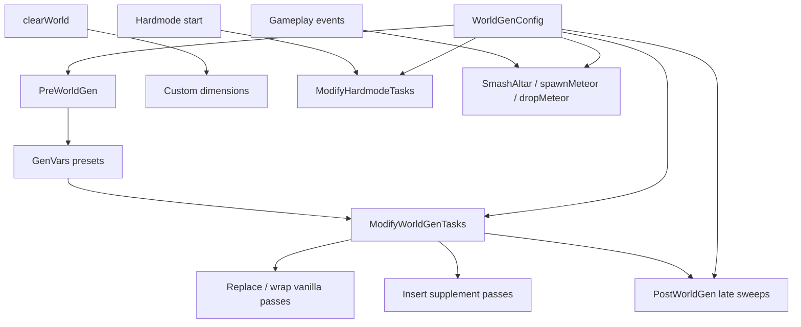

<!-- PRESERVATION RULE: Never delete or replace content. Append or annotate only. -->

# World Gen Expansions Roadmap

Reference for future features: tModLoader hooks, vanilla gen passes, risk tiers, and suggested implementation order.

**Related:** [ARCHITECTURE.md](ARCHITECTURE.md) · [MODDING_GUIDE.md](MODDING_GUIDE.md) · [Vanilla World Generation Steps (tML wiki)](https://github.com/tModLoader/tModLoader/wiki/Vanilla-World-Generation-Steps)

---

## Currently implemented

| Hook | System | What it controls |
|------|--------|------------------|
| `On_WorldGen.clearWorld` | `WorldSizeSystem` | Custom width / height |
| `ModifyWorldGenTasks` — replace **Shinies** | `OreGenSystem` | Pre-HM metal ores + alternates + rare meteorite scatter |
| `ModifyWorldGenTasks` — insert after **Underworld** | `OreGenSystem` | Hellstone supplement |
| `ModifyHardmodeTasks` — append pass | `OreGenSystem` | Chlorophyte supplement |
| `On_WorldGen.SmashAltar` | `OreGenSystem` | Bonus HM altar ore veins |
| `On_WorldGen.dropMeteor` | `OreGenSystem` | Bonus meteorite on meteor events |
| `PreWorldGen` — `GenVars.dungeonSide` | `FeatureGenSystem` | Force dungeon left / right |
| `ModifyWorldGenTasks` — insert after **Terrain** | `FeatureGenSystem` | Cave depth scaling (`worldSurface`, `rockLayer`) |
| `ModifyWorldGenTasks` — insert after gem passes | `FeatureGenSystem` | Gem vein supplement (6 types) |
| `ModifyWorldGenTasks` — insert after **Life Crystals** | `FeatureGenSystem` | Heart crystal supplement |
| `ModifyWorldGenTasks` — insert after chest passes | `FeatureGenSystem` | Buried chest supplement |
| `ModifyWorldGenTasks` — insert after **Floating Islands** | `FeatureGenSystem` | Floating island supplement |
| `ModifyWorldGenTasks` — insert after marble/granite passes | `FeatureGenSystem` | Marble + granite patch supplement |

**Ore UI:** All 21 [wiki ores](https://terraria.wiki.gg/wiki/Ores) catalogued in `Core/OreCatalog.cs`. Nineteen have multipliers; Obsidian and Luminite are documented as not world-gen controlled.

Everything below is **not implemented** unless marked otherwise.

---

## Hook types (tModLoader)

### ModSystem — world creation pipeline

| Method | When | Best for |
|--------|------|----------|
| `PreWorldGen` | Before any pass runs | Preset `GenVars` / layer heights / biome placement flags |
| `ModifyWorldGenTasks` | Pass list built, before generation | Replace, insert, or `GenPass.Disable()` vanilla passes |
| `PostWorldGen` | All passes finished | Whole-map sweeps, safe tile swaps, late structure placement |
| `ModifyHardmodeTasks` | Hardmode starts in an existing world | HM spread passes, chlorophyte-style supplements |

### `On_WorldGen.*` detours

Runtime or mid-generation hooks. Register in `ModSystem.Load()` / `Unload()`.

| Detour | Typical use |
|--------|-------------|
| `clearWorld` | Dimension override (done) |
| `SmashAltar` | HM ore scaling (supplement done; vanilla patch scaling possible) |
| `dropMeteor` / `spawnMeteor` | Meteor biome events |
| `GenerateWorld` | Logging or global presets only — avoid per-feature logic here |
| `AddBuriedChest`, `AddLifeCrystal`, `FloatingIsland`, etc. | Call from custom passes or `PostWorldGen` |

### Rules of thumb

1. **Find passes by name**, never hard-coded index — other mods reorder the list.
2. Use `GenPass.Disable()` to turn off vanilla steps; use defensive checks if a pass is missing.
3. Respect `GenVars.structures` — call `CanPlace` before placing structures; use `AddProtectedStructure` for custom landmarks.
4. Prefer **supplement passes** (insert after vanilla) over full replacement when vanilla logic is complex (Dungeon, Temple, liquids).
5. Custom dimensions + aggressive terrain/cave edits = highest crash risk on tiny debug worlds.

---

## Tier 1 — High value, fits existing slider pattern ✅ DONE

All implemented in `FeatureGenSystem.cs`.

### `PreWorldGen` + `GenVars`

Set flags before passes read them:

| Target | Fields / notes | Suggested UI |
|--------|----------------|--------------|
| Jungle placement | `GenVars.jungleOriginX`, jungle-related state | Jungle width / position preset |
| Dungeon side | `GenVars.dungeonSide` (−1 left, +1 right) | Force left / right / random |
| Layer depths | `GenVars.worldSurface`, `GenVars.rockLayer` | Cavern depth, underground thickness |
| Evil biome | Influence before **Corruption** pass | Evil biome width mul |

**New system:** `PreWorldGenSystem.cs` — read `WorldGenConfig`, write `GenVars` when `UseCustom`.

### Pass wraps via `ModifyWorldGenTasks`

| Pass name | Expansion idea | Hook style |
|-----------|----------------|------------|
| **Gems** / **Random Gems** / **Gems In Ice Biome** | Gem cave frequency | Replace or supplement |
| **Surface Ore and Stone** | Surface ore/stone patches | Supplement |
| **Floating Islands** | Island count / size | Wrap or scale loop count |
| **Life Crystals** | Heart crystal count | Supplement `AddLifeCrystal` |
| **Buried Chests** / **Surface Chests** / **Water Chests** | Chest density | Supplement `AddBuriedChest` |
| **Pots** | Breakable pot count | Supplement |
| **Pyramids** | Force, suppress, or scale | Wrap `Pyramid()` calls |
| **Micro Biomes** | Enchanted sword, camps, etc. | Supplement |
| **Marble** / **Granite** | Patch frequency | Supplement |
| **Mushroom Patches** | Surface glowing mushroom | Supplement |
| **Oasis** / **Shell Piles** | Desert / ocean micro-features | Supplement |
| **Traps** | Trap density | Supplement (risky on small maps) |
| **Hellforge** | Underworld forge count | Supplement |

**Suggested UI section:** “World Features” — Gems ×, Life Crystals ×, Chests ×, Floating Islands ×.

### Deeper `ModifyHardmodeTasks`

Vanilla tasks when HM starts: **Hardmode Good Remix**, **Hardmode Good**, **Hardmode Evil**, **Hardmode Walls**, **Hardmode Announcement**.

| Idea | Approach |
|------|----------|
| Scale evil / hallow spread | Wrap **Hardmode Good** / **Hardmode Evil** |
| “No spread” preset | `GenPass.Disable()` on spread passes |
| Custom HM features | Append passes (same pattern as chlorophyte) |

### `PostWorldGen`

Safest for mass changes after all vanilla passes:

- Tile sweeps (e.g. convert ore types world-wide)
- Extra structures with `GenVars.structures.CanPlace`
- Validation / cleanup pass

**New system:** `PostWorldGenSystem.cs` — optional late pass driven by config flags.

---

## Tier 2 — Runtime hooks (world already exists)

| Hook | Idea |
|------|------|
| `On_WorldGen.spawnMeteor` | Meteor **spawn chance** (complements `dropMeteor`) |
| `On_WorldGen.SmashAltar` (extend) | Scale vanilla patch size, not only bonus veins |
| Biome spread (`WorldGen.Spread`, tile `RandomUpdate`) | Post-plantera spread rate — “world evolution” |
| `ModifyHardmodeTasks` | One-time HM conversion burst tuning |

Meteorite: true biomes are event-driven; combine `spawnMeteor` + `dropMeteor` + Shinies scatter for full slider coverage.

---

## Tier 3 — Larger systems (new UI columns)

### Cave & terrain density

Passes: **Tunnels**, **Mount Caves**, **Dirt Layer Caves**, **Rock Layer Caves**, **Surface Caves**, **Wavy Caves**, **Mountain Caves**, **Gem Caves**, **Spider Caves**.

One global **Cave density ×** could wrap several passes with shared multiplier logic.

### Structures & landmarks

| Pass | Slider idea |
|------|-------------|
| **Dungeon** | Size / complexity (high coupling — fragile) |
| **Jungle Temple** / **Temple** / **Lihzahrd Altars** | Temple size, altar count |
| **Hives** | Bee hive count |
| **Altars** | Shadow orb / crimson heart count |
| **Living Trees** | Living tree frequency |
| **Spider Caves** | Spider cave density |

Always check `GenVars.structures` to avoid overwriting dungeon / temple.

### Liquids & oceans

**Lakes**, **Create Ocean Caves**, **Beaches**, **Settle Liquids**, **Waterfalls**, **Shimmer**.

UI: Lake count, ocean cave depth, beach width.

### Flora

**Planting Trees**, **Herbs**, **Jungle Plants**, **Vines**, **Flowers**, **Mushrooms**, **Cactus**, **Palm Trees**, **Coral**.

UI: Tree density, herb/plant abundance — good for “lush world” presets.

---

## Tier 4 — Infrastructure (do before 30+ sliders)

| Piece | Purpose |
|-------|---------|
| `GenPassCatalog` | Mirror `OreCatalog`: pass name, phase, risk tier, default mul |
| `PassWrapperHelper` | Shared replace / insert / supplement (like `OreScatterRunner`) |
| `PreWorldGenSystem` | Central `GenVars` presets |
| `PostWorldGenSystem` | Late sweeps + structure-safe placement |
| Preset bundles | “Resource-rich”, “Structure-heavy”, “Cave labyrinth”, “Minimal evil” |
| Config persistence | tML `Preferences` + optional `SaveWorldData` per world |

---

## Recommended implementation order

1. **Gems + Life Crystals + chests** — obvious in-game, low coupling  
2. **Floating Islands + Micro Biomes** — fun, moderate effort  
3. **PreWorldGen** jungle / evil / dungeon presets — “world shape” next to size sliders  
4. **Global cave density** — one mul, several cave passes  
5. **Hardmode Good / Evil wrap** — HM spread sliders  
6. **PostWorldGen** — catch-all for messy features  
7. **Persistence** — save last-used config between sessions  

---

## Passes to treat with care

| Pass | Risk |
|------|------|
| **Terrain**, **Reset** | Foundation — breaking these breaks everything |
| **Dungeon**, **Jungle Temple** | Hard-coded size assumptions; worst on non-vanilla dimensions |
| **Settle Liquids** | Order-sensitive |
| **Tile Cleanup**, **Final Cleanup** | Floating tiles, broken wires if replaced wrong |
| **GenerateWorld** (full wrap) | Too coarse for feature sliders |

---

## Architecture (target state)

---

## Adding a new expansion (checklist)

1. Add field(s) to `WorldGenConfig.cs` (or a dedicated `FeatureGenConfig`).
2. Add slider / preset in `WorldConfigUIState.cs` (or new UI section).
3. Implement hook in a `ModSystem` — pick tier from tables above.
4. If testable math, add helpers in `Core/` + tests in `WorldConfigMod.Tests/`.
5. Document in this file (append under tier) and [CHANGELOG.md](CHANGELOG.md).
6. Note caveats in [README.md](../README.md) if experimental on custom sizes.

---

## Non–world-gen expansions (same mod, different hooks)

| Feature | Hook / API |
|---------|------------|
| Persist settings | `ModLoader.Config` or `Preferences` |
| Per-world “created with” metadata | `ModSystem.SaveWorldData` / `LoadWorldData` |
| Multiplayer sync | Network packets + server authority on world create |
| Linux / Mac build | `build.sh` mirroring `build.bat` |

---

## References

- [tModLoader World Generation wiki](https://github.com/tModLoader/tModLoader/wiki/World-Generation)
- [Vanilla World Generation Steps](https://github.com/tModLoader/tModLoader/wiki/Vanilla-World-Generation-Steps)
- [WorldGen API (tML docs)](https://docs.tmodloader.net/docs/stable/class_world_gen.html)
- [ModSystem world gen hooks](https://docs.tmodloader.net/docs/stable/class_mod_system.html)
