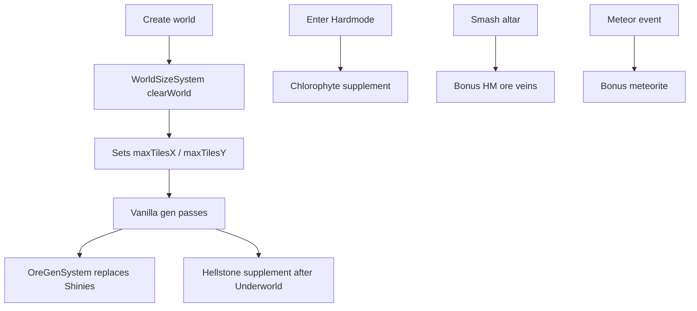
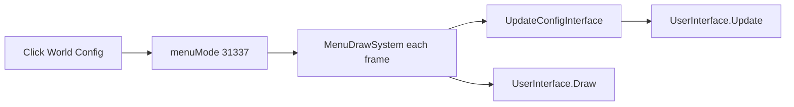

<!-- PRESERVATION RULE: Never delete or replace content. Append or annotate only. -->

# Modding World Config — Beginner Guide

**Who this is for:** You want to change this mod but you've never (or barely) touched C# or tModLoader. No shame — this guide assumes that.

**What you'll need:**
- [tModLoader](https://store.steampowered.com/app/1281930/tModLoader/) on Steam
- This repo on your PC
- A text editor (VS Code, Cursor, Notepad++ — anything)
- **Close tModLoader** before running `build.bat`

**Also read:** [`AGENTS.md`](../AGENTS.md) (AI/agent quick reference) · [`EXPANSIONS.md`](EXPANSIONS.md) (future features) · [tModLoader Wiki](https://github.com/tModLoader/tModLoader/wiki)

---

## The 60-second picture

```
You edit .cs files in this folder
        ↓
   test.bat  (optional — unit tests, no game needed)
        ↓
   build.bat  (close tModLoader first)
        ↓
   WorldConfigMod.tmod  (installed automatically)
        ↓
   Enable mod in tModLoader → Reload → test in game
```

Settings live in **`WorldGenConfig.cs`**. Ore definitions live in **`Core/OreCatalog.cs`**. Sliders read/write config in **`WorldConfigUIState.cs`**. World gen systems read config when you create a world.

---

## Step 0 — First successful build

1. Install tModLoader, launch it **once**, then **quit**.
2. Open a terminal in this folder.
3. Run:
   ```bat
   test.bat
   build.bat
   ```
   Or from PowerShell: `cmd /c test.bat` then `cmd /c build.bat`
4. You should see `BUILD OK` and a path ending in `WorldConfigMod.tmod`.
5. Open tModLoader → **Workshop → Mods** → enable **WorldConfigMod** → **Reload**.

If build says **tModLoader is running** — close the game completely and retry.

---

## Where everything lives (plain English)

| File / folder | What it does |
|---------------|--------------|
| `Common/WorldGenConfig.cs` | **Session settings.** World size, ore multipliers, presets, debug preset. |
| `Core/OreCatalog.cs` | **All 21 wiki ores** — keys, display names, gen phase, which get sliders. |
| `Core/OreGenMath.cs` | Vein count/size math (unit tested). |
| `Core/OreConfigHelper.cs` | Default ore dictionary, reset, key validation. |
| `Common/Ore/OreScatterSpecs.cs` | Tile IDs + scatter rates per ore. |
| `Common/Ore/OreScatterRunner.cs` | Calls `WorldGen.OreRunner` with config multipliers. |
| `Common/Systems/OreGenSystem.cs` | All ore world-gen hooks (Shinies, hellstone, HM, meteor). |
| `Common/Systems/WorldSizeSystem.cs` | Custom width/height at `clearWorld`. |
| `Common/Systems/UIInjectSystem.cs` | Overlay button, open/close panel, **`UpdateConfigInterface`**. |
| `Common/Systems/MenuDrawSystem.cs` | Draws menu + config UI; **calls input update every frame**. |
| `UI/WorldConfigUIState.cs` | Two-column config screen (world left, ores right). |
| `UI/Elements/UISliderRow.cs` | One slider row. |
| `UI/Elements/UITextButton.cs` | One button. |
| `UI/Elements/UIScrollColumn.cs` | Scrollable ore list + wheel forwarding. |
| `WorldConfigMod.Tests/` | Unit tests (links `Core/` — not shipped in `.tmod`). |
| `test.bat` | Runs unit tests. |
| `build.bat` | Builds `.tmod` (excludes `DOCS/`, `Tests/`). |
| `DOCS/EXPANSIONS.md` | Roadmap for gems, caves, biomes, etc. |
| `AGENTS.md` | Instructions for AI coding agents. |

**Rule of thumb:** numbers → `WorldGenConfig` + `Core/`; screen → `WorldConfigUIState`; world gen → `Common/Systems/` + `Common/Ore/`.

---

## Dev loop (do this every time you change code)

1. **Edit** a `.cs` file and save.
2. Run **`test.bat`** if you touched `Core/` or tests.
3. **Close** tModLoader (if open).
4. Run **`build.bat`** — wait for `BUILD OK`.
5. **Launch** tModLoader → **Reload Mods**.
6. **Test:** Single Player → New → **World Config**.

Broke something? Read the red errors in the terminal. The line number points to the file and line to fix.

---

## Recipe 1 — Change default world size

Open `Common/WorldGenConfig.cs`:

```csharp
public static int WorldWidth = 4200;   // ← change me
public static int WorldHeight = 1200;  // ← change me
```

Also update `Reset()` if you want "Reset Defaults" to match.

Rebuild, reload, test.

---

## Recipe 2 — Change the debug preset (tiny map + crazy ore)

In `WorldGenConfig.cs`, find `ApplyDebugWorldGenPreset()`:

```csharp
public static void ApplyDebugWorldGenPreset()
{
    UseCustom = true;
    WorldWidth = MinWidth;      // 1750
    WorldHeight = MinHeight;    // 600
    // [AMENDED 2026-05-20]: MinWidth/MinHeight are now 4200/1200 (vanilla Small floor).
    OreVeinSizeMul = 20f;
    OreFrequencyMul = 20f;
    OreConfigHelper.ResetAll(OreMul);
}
```

**What the numbers mean:**
- **Vein size** → `OreRunner` strength/steps (`OreGenMath.ComputeVeinSize`).
- **Frequency** → vein count (`OreGenMath.ComputeVeinCount`).
- **Per-ore multiplier** → per-key knob in `OreMul` dictionary.

Rough formula: `area × baseRate × GlobalFrequency × PerOreMul`.

---

## Recipe 3 — Add a new size preset button

1. Add a case to `ApplyPresetSize` in `WorldGenConfig.cs`.
2. Add a button in `MakePresetGrid()` inside `WorldConfigUIState.cs`.
3. Rebuild and test.

---

## Recipe 4 — Add a new slider (non-ore)

**Step A** — field in `WorldGenConfig.cs`:

```csharp
public static float JungleSizeMul = 1f;
```

**Step B** — slider in `BuildLeftRows()` or `BuildRightRows()` in `WorldConfigUIState.cs`:

```csharp
_leftList.Add(new UISliderRow("Jungle Size", 0.5f, 3f,
    WorldGenConfig.JungleSizeMul, 0.1f, false,
    v => $"×{v:0.00}",
    v => WorldGenConfig.JungleSizeMul = v,
    labelWidth: 110, valuePad: 56));
```

**Step C** — consume it in a `ModSystem` (see `EXPANSIONS.md` for hook ideas). A slider alone does nothing until a system reads the value.

---

## Recipe 5 — Add a new ore multiplier

1. Add entry to `Core/OreCatalog.cs` (key, display name, `OreGenPhase`, `hasWorldGenMultiplier`).
2. If world-gen controlled: add spec in `Common/Ore/OreScatterSpecs.cs` and wire hook in `OreGenSystem.cs` (match phase: Shinies, Underworld, HardmodeAltar, etc.).
3. UI auto-lists `OreCatalog.WithMultipliers` — no UI change for standard ores.
4. Add/adjust tests in `WorldConfigMod.Tests/OreCatalogTests.cs`.
5. Run `test.bat` then `build.bat`.

---

## Recipe 6 — Add a scrollable list section

The right ore column uses **`UIScrollColumn`** wrapping `UIList` + `UIScrollbar`.

If you add another long list:
1. Copy the pattern in `BuildColumns()` (`_rightScrollCol`, list, scrollbar).
2. Ensure **`UIInjectSystem.UpdateConfigInterface`** runs every frame (already called from `MenuDrawSystem`).
3. For wheel scroll over your list, forward via `ApplyScrollWheel` or override `ScrollWheel` on a panel wrapper.
4. Call `PlayerInput.LockVanillaMouseScroll` in `DrawSelf` when hovering (see `UIScrollColumn.cs`).

**Do not** assume `ModSystem.UpdateUI` alone drives menu UI input.

---

## Recipe 7 — Change overlay button text

`Common/Systems/UIInjectSystem.cs`:

```csharp
const string text = "World Config";
```

Rebuild. For localization later, use `Localization/*.hjson` and `Language.GetText(...)`.

---

## Recipe 8 — Add a world-gen expansion (gems, chests, etc.)

Read **`DOCS/EXPANSIONS.md`** first. Typical pattern:

1. Add config field(s) to `WorldGenConfig`.
2. Add slider(s) in `WorldConfigUIState`.
3. In a `ModSystem`, use `ModifyWorldGenTasks` to **replace** or **insert after** a vanilla pass by **name** (never hard-coded index).
4. Prefer **supplement passes** over replacing complex passes (Dungeon, Temple, liquids).

---

## How world generation hooks work

When you click **Create** with **Use Custom Generation = ON**:



- **WorldSizeSystem** — must set size *before* tile array alloc.
- **OreGenSystem** — supplements/replaces ore passes; see README ore coverage table.

---

## How the config UI works (important for UI changes)



Vanilla `DrawMenu` is **skipped** in config mode — so input must be driven from `MenuDrawSystem` → `UpdateConfigInterface`.

---

## Gotchas (read this before you rage-quit)

| Problem | Fix |
|---------|-----|
| `build.bat` fails — game running | Close tModLoader completely. |
| `DynamicSpriteFont` / `DrawString` error | Use `Utils.DrawBorderString`. |
| `double` vs `float` error | Cast: `(float)x` or use `0f` suffixes. |
| Button doesn't show | Mod enabled? On **New World** screen? Reload mods. |
| Ores look vanilla | **Use Custom Generation = ON** before Create. |
| Scroll / scrollbar dead | Ensure `UpdateConfigInterface` runs before draw in `MenuDrawSystem`. |
| Column titles overlap sliders | Lists must start **below** column title bar (`ColumnTitleHeight`). |
| World gen crashes on tiny maps | Below ~4200×1200 is experimental. Debug preset = minimum size. |
| `SpriteBatch.Begin` crash | `EnsureSpriteBatchClosed` in `MenuDrawSystem`. |
| Tests compile into mod | Keep `WorldConfigMod.Tests` excluded in `.csproj` + `build.bat` `/XD`. |
| Changes don't appear | Rebuild **and** reload mods. |

---

## Safe areas vs. be careful

**Safe for beginners:**
- Numbers in `WorldGenConfig` and `Core/OreCatalog`
- Slider min/max in `WorldConfigUIState`
- Button labels, colors, toasts
- Unit tests in `WorldConfigMod.Tests`

**Be careful:**
- `WorldSizeSystem` — wrong values crash world gen
- Replacing vanilla gen passes wholesale (Dungeon, Terrain, liquids)
- Custom menu input path — breaking `UpdateConfigInterface` breaks all clicks/scroll
- Worlds smaller than vanilla small — structure placement may break

---

## Quick reference — slider ranges

| Slider | Min | Max | Default |
|--------|-----|-----|---------|
| World Width | 1750 | 16800 | 4200 |
| World Height | 600 | 4800 | 1200 |
| Vein Size | ×0.25 | ×25 | ×1 |
| Global Frequency | ×0.1 | ×25 | ×1 |
| Per-Ore (19 types) | ×0 | ×5 | ×1 |

Debug preset: **1750×600**, vein **×20**, frequency **×20**, custom gen **ON**. Orange footer button **DEBUG: Tiny + 20× Ore**.

## [AMENDED 2026-05-20]: Safe size floor + V2 UI

| Slider | Min | Max | Default |
|--------|-----|-----|---------|
| World Width | **4200** | 16800 | 4200 |
| World Height | **1200** | 4800 | 1200 |

Debug preset: **4200×1200** (vanilla Small — lowest size that survives vanilla gen passes), vein **×20**, frequency **×20**, custom gen **ON**.

New sliders: prefer **`WorldConfigUIStateV2.cs`** tab builders (`UICompactSliderRow`). Legacy V1: `WorldConfigUIState.cs`.

---

## Next steps

- [`ARCHITECTURE.md`](ARCHITECTURE.md) — system diagram  
- [`EXPANSIONS.md`](EXPANSIONS.md) — future world-gen features  
- [`STYLE_GUIDE.md`](STYLE_GUIDE.md) — naming conventions  
- [`AGENTS.md`](../AGENTS.md) — agent workflow  
- [tML World Generation wiki](https://github.com/tModLoader/tModLoader/wiki/World-Generation)

---

## [AMENDED 2026-05-19]:

Initial beginner modding guide. Documents debug preset, slider ranges, and common compile pitfalls for net8.0 tML.

## [AMENDED 2026-05-19]: Full ore catalog + tests

Recipe 5 updated for `Core/OreCatalog`. Added `test.bat` to dev loop. Documented `OreScatterSpecs` / `OreGenSystem` hooks.

## [AMENDED 2026-05-19]: UI input + scroll + layout

Documented `UpdateConfigInterface`, `UIScrollColumn`, two-column layout, title bar spacing. Added Recipe 6 (scroll lists) and Recipe 8 (expansions). Linked `AGENTS.md` and `EXPANSIONS.md`.
